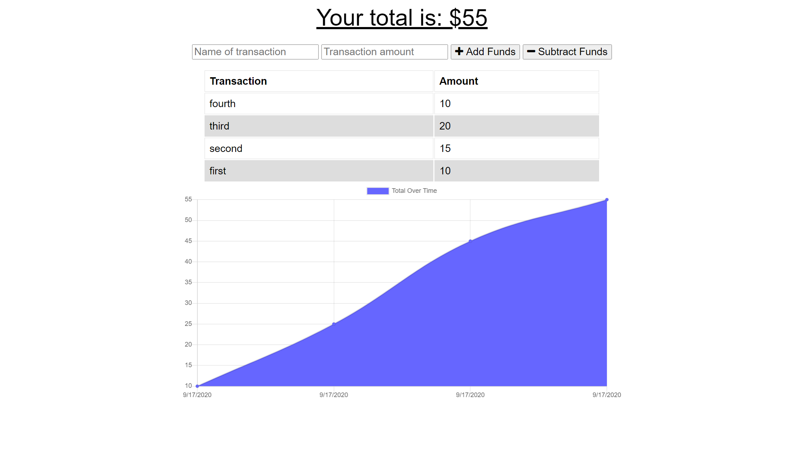

# Budget-Tracker

## Table of Contents 

* [About](#About)
* [Deployment](#Deployment)
* [Installation](#Installation)
* [Usage](#Usage)
* [Technologies](#Technologies)
* [License](#License)
* [Tests](#Tests)
* [Screenshots](#Screenshots)
* [Author](#Author)
* [Questions](#Questions)

## About 

This app demonstrates the usage of a service worker and is able to cache files to serve them offline.

## Deployment 

https://employee-directory-kmb.herokuapp.com/

## Installation

To use this app on your local computer 

* Clone the repo

* Run the command ``` npm i ``` to install dependancies 

* To run the server ``` npm start ``` 
    
## Usage
    
To keep track of workouts, and be able to use the app offline.

## Technologies 
    
Technologies used in this application: Javascript, Node, HTML, and CSS

## License
    
MIT     

## Tests

No tests.

## Screenshots



## Author

Keith Billings
    
## Questions: 
    
If you have any questions about this project or would like to collaborrate with the authors, please reach out to anyone on the team. We look forward to working with you!

- [Keith Billings](https://github.com/KeithBillings) @ keithbillingsbusiness@gmail.com